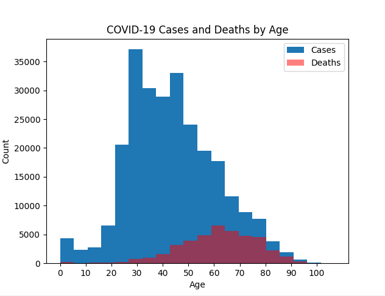
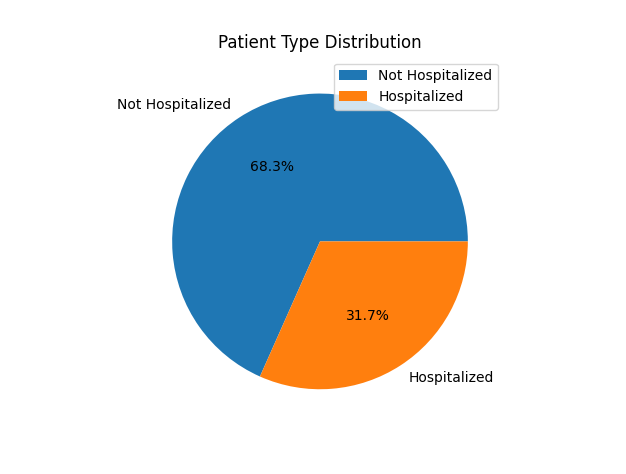
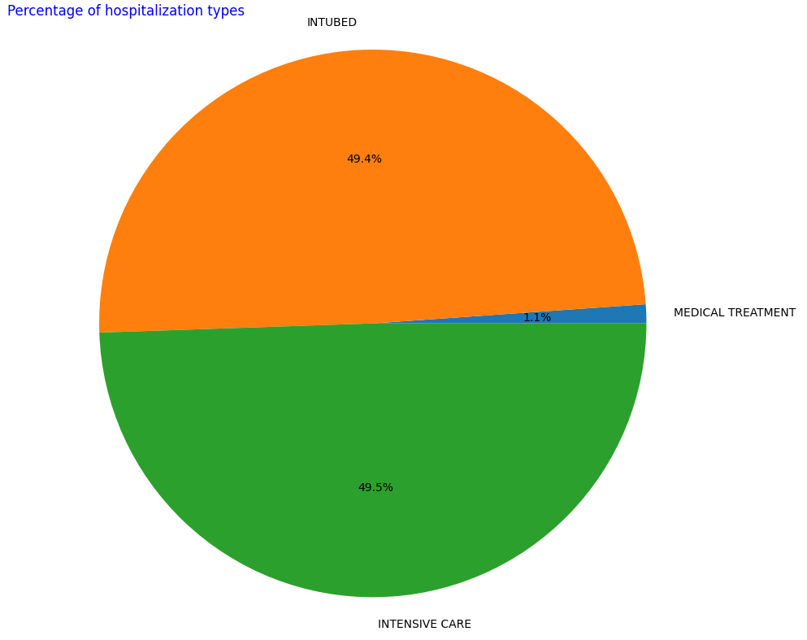
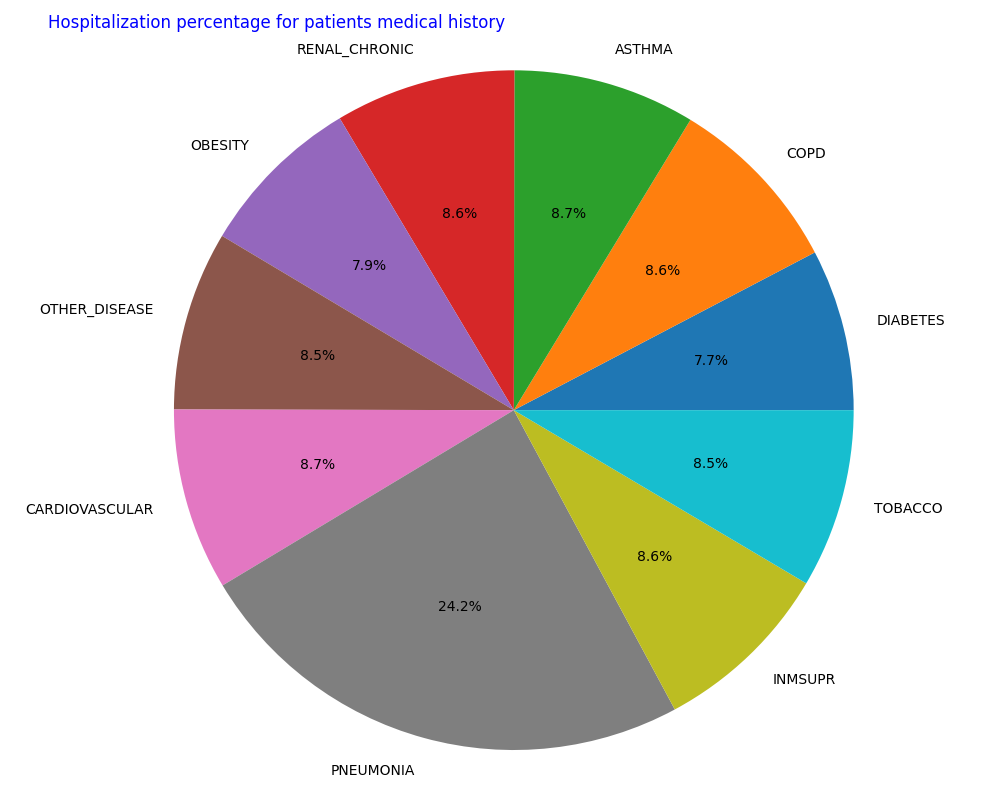
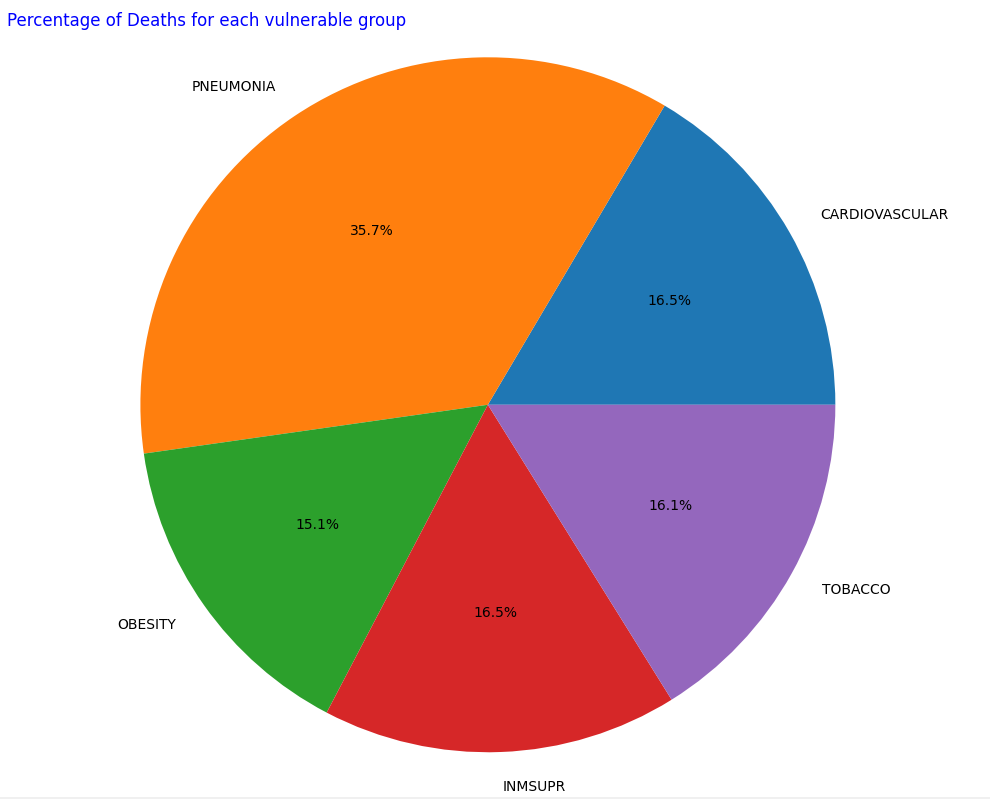
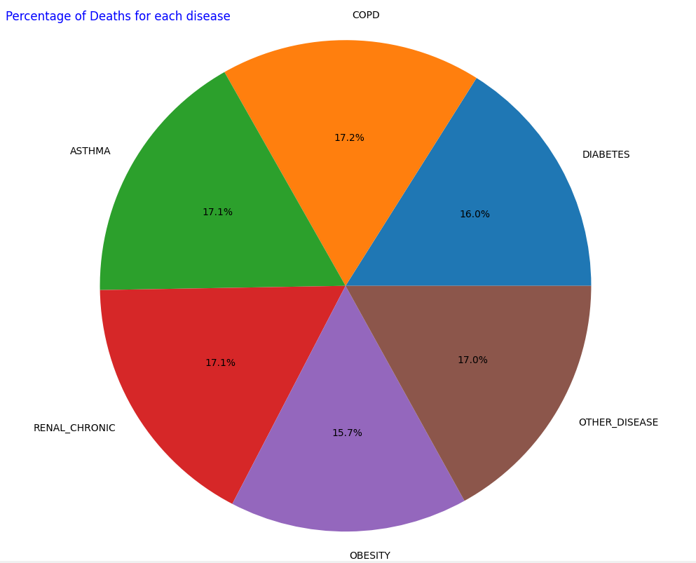

# COVID-19 Data Analysis and Visualization

This project implements a COVID-19 data analysis and visualization tool using the MapReduce algorithm. It processes COVID-19 data, extracts various insights, and generates interactive visualizations to facilitate deeper analysis.

## Dependencies
The following dependencies are required to run the code:

- `webbrowser`
- `numpy`
- `pandas`
- `matplotlib`
- `tkinter`
- `PIL`

## Getting Started

To use this program, follow the steps below:

1. Clone the repository to your local machine.
2. Install the required dependencies by running `pip install -r requirements.txt`.
3. Run the `covid_analysis.py` script to start the program.

## MapReduce Approach

The COVID class follows a MapReduce approach for data analysis. The main steps involved are:

1. Splitting the data into chunks and mapping each chunk to extract relevant information.
2. Shuffling and sorting the mapped data by key.
3. Reducing the shuffled data by combining values with the same key.
4. Processing the reduced data and generating interactive visualizations.

## Dataset

The program uses the COVID-19 dataset, which was provided by the Mexican government and can be found [here](https://www.kaggle.com/datasets/meirnizri/covid19-dataset). This dataset contains an enormous number of anonymized patient-related information including pre-conditions. The raw dataset consists of 21 unique features and 1,048,576 unique patients. In the Boolean features, 1 means "yes" and 2 means "no". values as 97 and 99 are missing data.

## Functionality
The **COVID-19** data analysis and visualization tool performs the following steps:

* **Split Data**: The data is split into chunks for parallel processing.
* **Map Data**: Each data chunk is independently analyzed to extract insights such as age counts, patient type counts, hospitalization types, and deaths related to COVID-19.
* **Shuffle Data**: The mapped data is shuffled and sorted based on a key.
* **Reduce Data**: The shuffled data is reduced by combining values with the same key.
* **Process Data**: The reduced data is processed and analyzed to generate interactive visualizations. The visualizations include:

     * Histogram showing COVID-19 cases and deaths by age.
    * Pie chart showing the distribution of patient types (returned home vs. hospitalization).
    * Pie chart showing the percentage distribution of hospitalization types.
    * Pie chart showing the percentage of hospitalized patients based on pre-existing diseases.
    * Pie chart showing the percentage of deaths for each vulnerable group.
    * Pie chart showing the percentage of deaths for each pre-existing disease.

    
## Visualizations

The program generates the following visualizations:

1. COVID Incidents/Deaths Based on Age: Histogram showing the distribution of COVID-19 cases and deaths by age.
   

2. COVID Incidents and Hospitalization: Pie chart showing the distribution of patient types (returned home vs. hospitalization).
   

3. Hospitalization Types: Pie chart showing the percentage distribution of different hospitalization types.
   

4. Hospitalization Percentage for Patients' Medical History: Pie chart showing the percentage of hospitalized patients based on their medical history.
   

5. COVID Deaths for Each Pre-condition Vulnerabilities: Pie chart showing the percentage of deaths for each group of pre-condition vulnerabilities.
   

6. COVID Deaths for Each Pre-condition Diseases: Pie chart showing the percentage of deaths for each group of pre-condition diseases.
   

